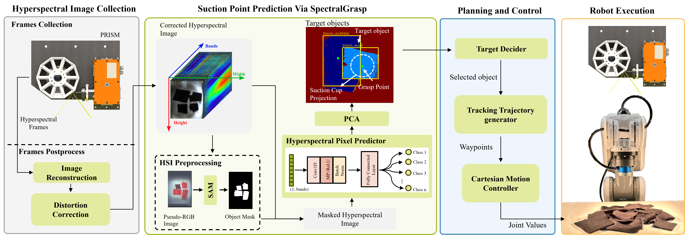
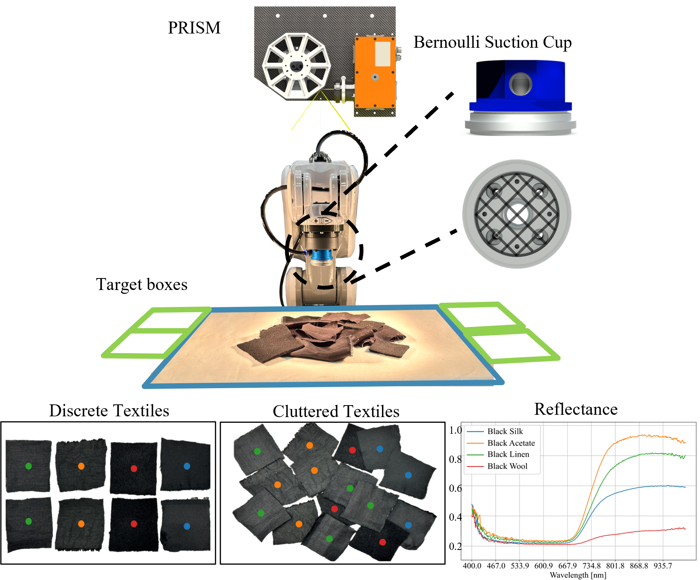
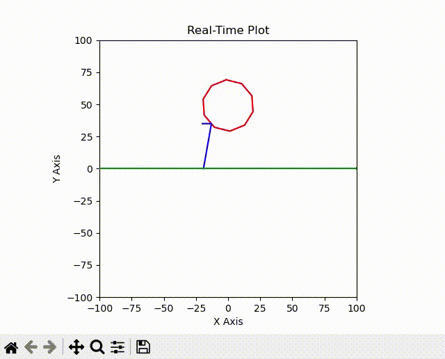
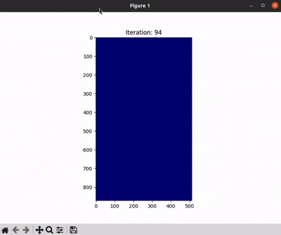

<h2 align="center">
  <b>A Hyperspectral Imaging Guided Robotic Grasping System,</b>

<b><i></i></b>
</h2>

This is the official code release of [A Hyperspectral Imaging Guided Robotic Grasping System]().


[[paper]]() [[project]](https://zainzh.github.io/PRISM/) [[code]](https://github.com/ZainZh/PRISM) [[Datasets]](https://huggingface.co/datasets/ZainZh/PRISM/blob/main/cloth_hyperspectral_datasets.zip) [[CAD files]](https://huggingface.co/datasets/ZainZh/PRISM/blob/main/PRISM_SOLIDWORKS2019.zip)


<div align=center>
    
</div>
<div align=center>
    
</div>
## Environment

The complete deployment of the project includes the following components:

- Model Training and Inference
- Robotic Manipulation
- PRISM Control (Hyperspectral Camera, Motors)

Due to the windows required of the hyperspectral camera control interface, the project is developed on :

- Windows 10.

But the model training and inference can be run on any platform such as **Ubuntu 20.04 (tested)** that supports PyTorch.

## Installation

1. Create conda environment and install pytorch

   This code is tested on Python 3.10.14 on Ubuntu 20.04 and Windows 10.

    ```
    conda create -n prism python=3.10
    conda activate prism
    # pytorch with cuda 11.8
    pip3 install torch torchvision torchaudio --index-url https://download.pytorch.org/whl/cu118
    ```

2. Dependencies

   Install dependencies

    ```
    pip install joblib
    pip install tqdm
    pip install tensorboard
    pip install omegaconf
    pip install opencv-python
    pip install matplotlib 
    pip install scipy
    pip install scikit-learn
    pip install plantcv
    pip install spectral
    pip install numpy==1.26.4
    pip install h5py
    ```

## Inference and Visualization

Only tested under the pycharms environment. please unclick the "Run with Python Console" and  "view > Scientific Mode"
option in the run configuration.

Run commands below to run the prism working animation:

```bash
python scripts/prism_animation.py
```

<div align=center>
    
</div>
After finished, you shall see printed 3D affordance results w/ grasp and visualization
at `run_realworld/gym_outputs/drawer_open/` like below:

## Train and Test
You can modify the config parameter `model_type` in `config/train.yaml` to train the specific model.
```bash
python scripts/train.py
```

You can also run the test script to evaluate the trained model.

```bash
python scripts/test.py
```

<div align=center>
    
</div>

## Control Codes

All C++ device control codes are in the "c_device" folder. This includes control modules for Modbus devices, the Nachi
robot, and the Specim linescan camera.
```bash
--c_device
    --libModbus
    --nachi  
    --specim 
```
<!-- ## Citation

If you find this work helpful, please consider citing:

```
@article{kuang2024ram,
  title={RAM: Retrieval-Based Affordance Transfer for Generalizable Zero-Shot Robotic Manipulation},
  author={Kuang, Yuxuan and Ye, Junjie and Geng, Haoran and Mao, Jiageng and Deng, Congyue and Guibas, Leonidas and Wang, He and Wang, Yue},
  journal={arXiv preprint arXiv:2407.04689},
  year={2024}
}
``` -->
